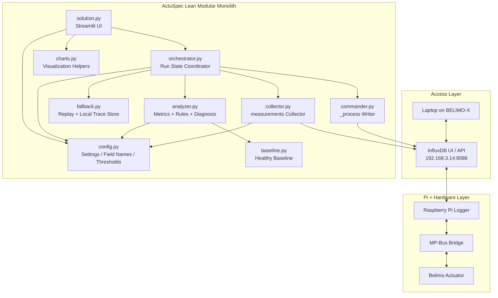
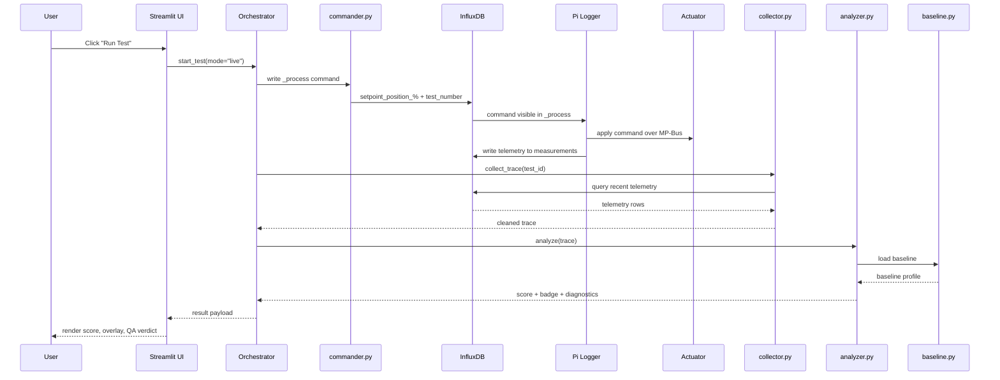

# CLAUDE.md — ActuSpec Final Architecture
## START Hack 2026 · Belimo Smart Actuators  
**Repo final architecture**

---

## 1. Project identity

**Product name:** ActuSpec  
**Tagline:** *We gave actuators an ECG.*

**One-line description:**  
ActuSpec is a live actuator commissioning and diagnostics tool that turns torque, position, temperature, and related telemetry into a mechanical fingerprint, a health score, and a commissioning verdict.

**Primary user:**  
Installer / system integrator

**Primary workflow:**  
Run a controlled actuator stroke → capture telemetry → compare against healthy baseline → generate diagnosis

---

## 2. Architecture decision

### Final architecture choice
**Lean modular Streamlit monolith**

This is the final architecture because it gives the best balance of:
- speed of implementation
- demo reliability
- debugging simplicity
- technical credibility
- fallback safety

### What it is
A single Python app launched with Streamlit, backed by a few small internal modules.

### What it is not
- not microservices
- not a React + FastAPI split
- not event-driven infrastructure
- not heavy ML
- not production-grade backend complexity
- not direct actuator-control software

---

## 3. System access model

### Network access
The laptop connects to the Raspberry Pi hotspot:

- **SSID:** `BELIMO-X`
- **Password:** `raspberry`

`X` is the digit shown on the Raspberry Pi label.

### InfluxDB access
All live interactions go through InfluxDB:

- **URL:** `http://192.168.3.14:8086`
- **Username:** `pi`
- **Password:** `raspberry`

### Important system reality
ActuSpec does **not** communicate with the actuator directly.

The actual live path is:

1. ActuSpec writes commands into InfluxDB measurement `_process`
2. The Raspberry Pi logger reads those commands
3. The Raspberry Pi logger applies them to the actuator over MP-Bus
4. The Raspberry Pi logger writes actuator telemetry into measurement `measurements`
5. ActuSpec reads telemetry from `measurements` and analyzes it

The Raspberry Pi logger is the real hardware bridge.  
ActuSpec is a diagnostics and interaction layer on top of that pipeline.

---

## 4. Core architectural principles

1. **Replay mode is first-class, not backup polish**  
   The app must work even if live hardware interaction fails.

2. **One process, few modules, clear boundaries**  
   Keep runtime simple, but avoid a single giant file.

3. **Analysis must be deterministic and explainable**  
   Rule-based logic beats fragile sophistication.

4. **UI must show one clear story**  
   Healthy baseline vs current run, plus a clear verdict.

5. **Live mode is an upgrade, not a dependency**  
   The demo should still survive if command writing or telemetry timing becomes unreliable.

6. **InfluxDB is the only required live interface**  
   The architecture assumes no direct SSH, serial, or MP-Bus control from the laptop.

7. **Useful traces must be preserved locally**  
   Pi-side data is not persistent across reboots, so baselines and replay traces must be saved on the laptop.

---

## 5. Final file structure

```text
Belimo_hack/
├── CLAUDE.md
├── README.md
├── requirements.txt
├── solution.py          # Streamlit app entrypoint
├── orchestrator.py      # run-state coordination
├── commander.py         # InfluxDB _process command writer
├── collector.py         # InfluxDB measurements trace retrieval
├── analyzer.py          # metrics, scoring, rules, diagnosis
├── baseline.py          # healthy baseline loading/comparison
├── fallback.py          # prerecorded trace loading + local persistence
├── charts.py            # plotting helpers
├── config.py            # field names, thresholds, constants
└── data/
    ├── baseline_healthy.json
    ├── replay_healthy.json
    ├── replay_fault.json
    └── replay_commissioning.json
```

---

## 6. Responsibilities of each module

### `solution.py`
**Role:** UI entrypoint

**Responsibilities:**
- Streamlit page layout
- tab navigation
- mode selection: Live / Replay
- Run Test buttons
- session state display
- rendering charts, scores, badge, explanation

This file should contain **UI logic only**, not raw InfluxDB queries or scoring formulas.

---

### `orchestrator.py`
**Role:** central run coordinator

**Responsibilities:**
- create unique `test_id`
- maintain run state:
  - `idle`
  - `commanding`
  - `collecting`
  - `analyzing`
  - `done`
  - `error`
- prevent multiple simultaneous runs
- coordinate:
  - commander
  - collector
  - analyzer
  - fallback
- return final result payload to UI

This is the most important non-UI module.

---

### `commander.py`
**Role:** InfluxDB `_process` command writer

**Responsibilities:**
- write command rows into measurement `_process`
- send at minimum:
  - `setpoint_position_%`
  - `test_number`
- optionally use the documented epoch-timestamp command convention
- hide low-level write details from UI

**Important note:**  
This module does **not** control the actuator directly.  
The Raspberry Pi logger reads `_process` and applies commands to the actuator over MP-Bus.

---

### `collector.py`
**Role:** telemetry acquisition from `measurements`

**Responsibilities:**
- query InfluxDB measurement `measurements`
- load recent telemetry window
- extract the relevant run trace
- build a clean DataFrame with:
  - `feedback_position_%`
  - `setpoint_position_%` if available
  - `motor_torque_Nmm`
  - `internal_temperature_deg_C`
  - `power_W` if available
  - `rotation_direction` if available
  - `test_number` if available
  - timestamps

**Important design rules:**
- do **not** depend only on a fragile exact start/stop window
- prefer querying a recent broader window, then extracting the run segment
- absolute Pi timestamps may be offset; use `test_number`, relative ordering, and signal patterns to isolate runs
- field names must be verified on site against the actual bucket schema

---

### `analyzer.py`
**Role:** scoring + diagnosis engine

**Responsibilities:**
- compute baseline comparison
- compute commissioning checks
- compute derived metrics:
  - torque profile
  - RMS deviation vs healthy baseline
  - tracking error
  - torque variability
  - temperature rise
  - optional hysteresis / phase-portrait features
- return:
  - health score
  - commissioning badge
  - metric statuses
  - diagnosis text
  - chart-ready data

This module must be deterministic and explainable.

---

### `baseline.py`
**Role:** healthy reference manager

**Responsibilities:**
- load healthy baseline trace from local storage
- generate baseline profile
- expose baseline reference to analyzer
- support export/import of certified healthy baseline traces

For MVP:
- one healthy certified baseline per actuator/demo setup is enough

Do **not** build a general factory baseline management system.

---

### `fallback.py`
**Role:** replay trace provider and local trace persistence

**Responsibilities:**
- load prerecorded traces from local JSON/CSV files
- provide healthy scenario
- provide degraded scenario
- provide commissioning scenario
- save useful live traces locally for later replay
- preserve baseline traces outside the Pi bucket

Replay mode must reuse the same analysis pipeline as live mode.

---

### `charts.py`
**Role:** plotting helpers

**Responsibilities:**
- torque vs position phase portrait
- healthy vs current overlay
- health score visuals
- commissioning badge visuals
- optional fleet bar chart

Keep charting separate from analysis logic.

---

### `config.py`
**Role:** central constants and environment mapping

**Responsibilities:**
- Influx host / bucket / org / token / measurement names
- expected field names
- thresholds
- replay file paths
- default mode
- demo constants
- hotspot / Influx defaults for local setup

This prevents scattered hardcoding and makes on-site adaptation faster.

---

## 7. Runtime modes

### Mode A — Live
Used when:
- laptop is connected to `BELIMO-X`
- InfluxDB is reachable
- command writing to `_process` works
- telemetry arrives correctly in `measurements`
- time pressure is manageable

**Flow:**
1. User clicks **Run Live Test**
2. Orchestrator creates `test_id`
3. Commander writes command sequence into `_process`
4. Raspberry Pi logger applies commands to actuator over MP-Bus
5. Collector pulls recent telemetry from `measurements`
6. Collector extracts run segment using `test_number`, recent windows, and signal shape
7. Analyzer compares against baseline
8. UI shows score, overlay, badge, diagnosis

---

### Mode B — Replay
Used when:
- live command path fails
- telemetry timing is unreliable
- demo reliability must be guaranteed
- the Pi bucket has been reset
- baseline or live traces need to be replayed consistently

**Flow:**
1. User selects prerecorded scenario
2. Fallback loader loads locally saved trace
3. Analyzer runs unchanged
4. UI shows same outputs as live mode

Replay mode is a **core feature**, not an apology.

---

## 8. Final UI structure

### Tab 1 — Live Monitor
**Purpose:**
- show current telemetry
- let user choose Live or Replay
- start test run

**Show:**
- mode selector
- current signal chart
- Run Test button
- current run status

---

### Tab 2 — Healthy Baseline
**Purpose:**
- explain what “normal” means
- make the ECG analogy concrete

**Show:**
- baseline torque-vs-position profile
- optional baseline metadata
- overlay of baseline vs latest run

---

### Tab 3 — Health Score
**Purpose:**
- show the main diagnostic result

**Show:**
- score 0–100
- healthy vs current overlay
- traffic-light statuses
- short explanation text

---

### Tab 4 — Commissioning QA
**Purpose:**
- deliver the installer-facing verdict

**Show:**
- pass / marginal / fail badge
- check breakdown:
  - range of motion
  - torque variability
  - tracking error
  - temperature rise
- recommended next action

---

## 9. Data model assumptions

The architecture assumes the repo-documented Influx layout.

### InfluxDB connection
- **Bucket:** `actuator-data`
- **Telemetry measurement:** `measurements`
- **Command measurement:** `_process`

### Telemetry fields in `measurements`
Expected fields include:
- `feedback_position_%`
- `setpoint_position_%`
- `motor_torque_Nmm`
- `internal_temperature_deg_C`
- `power_W`
- `rotation_direction`
- `test_number`

### Command fields in `_process`
Expected fields include:
- `setpoint_position_%`
- `test_number`

### Timestamp handling
- command writes may use the repo’s epoch-timestamp convention
- telemetry timestamps come from the Raspberry Pi logger
- Pi-side clock may not be calibrated to wall-clock time
- absolute timestamps should not be trusted blindly
- relative signal order, recent windows, and `test_number` are preferred for trace extraction

### Important implementation rule
Field names and bucket contents must be verified **on site early** in the InfluxDB UI.  
Do not overengineer abstraction for unknown schemas.

---

## 10. Main analysis logic

### 10.1 Healthy baseline comparison
- split stroke into bins
- compute baseline torque profile
- compute current torque profile
- compare using RMS deviation or similar simple metric

**Output:**
- health score
- profile overlay
- deviation heat

---

### 10.2 Commissioning checks
At minimum:
1. **Range of motion**
2. **Tracking error**
3. **Torque variability**
4. **Temperature rise**

**Output:**
- pass / marginal / fail
- short installer recommendation

---

### 10.3 Diagnostic explanations
Use deterministic text templates.

**Examples:**
- “Localized resistance appears around mid-stroke.”
- “Torque variability suggests obstruction or misalignment.”
- “Tracking error suggests coupling or command-response mismatch.”
- “Thermal rise suggests overload or inefficiency.”

Avoid vague AI-style explanations.

---

## 11. Main Mermaid architecture diagram



---

## 12. Main sequence diagram



---

## 13. What we are intentionally **not** building

To stay maximum-optimum for 32 hours, we are **not** building:
- microservices
- React frontend
- WebSockets
- real-time streaming infrastructure
- complex ML
- generalized fleet backend
- production authentication
- production persistence layer
- heavy PDF generation
- enterprise device registry
- direct MP-Bus or serial control from the laptop
- SSH-dependent runtime architecture

These do not increase win probability enough.

---

## 14. Build priority order

### P0 — Guaranteed demo first
Build in this order:

#### Step 1
`fallback.py` + `baseline.py` + minimal `analyzer.py`

**Goal:**
- make Replay mode work first
- preserve baseline and test traces locally from day one

#### Step 2
Minimal `solution.py`
- baseline view
- score view
- commissioning view

**Goal:**
- have something demoable even without hardware

#### Step 3
`collector.py`
- verify Influx access at `192.168.3.14:8086`
- inspect bucket / measurement / fields
- load real traces from `measurements`

#### Step 4
`commander.py`
- verify writing to `_process`
- confirm `setpoint_position_%` and `test_number` flow

#### Step 5
`orchestrator.py`
- unify Live and Replay
- manage run states
- isolate command / collect / analyze flow

#### Step 6
Chart polish in `charts.py`

#### Step 7
Optional extras only if ahead:
- simple fleet comparison
- export button
- better text refinement

---

## 15. Fallback and persistence policy

### Replay policy
Replay mode must always be ready before the final demo.

### Local persistence policy
Because the Pi bucket is not persistent across reboots:
- export healthy baseline traces locally
- export at least one healthy live trace locally
- export at least one degraded/faulted trace locally
- store replay scenarios in `data/`

### If behind schedule

#### Keep
- Replay mode
- baseline comparison
- health score
- commissioning badge
- overlay chart

#### Cut
- fleet intelligence as a real feature
- fancy report export
- extra metrics that are hard to validate
- advanced UI polish

If hardware is unreliable:
- make Replay the official demo path
- keep one live monitor tab only as a bonus

---

## 16. Recommended `requirements.txt`

```txt
streamlit
influxdb-client
pandas
numpy
scipy
altair
```

Optional only if needed:
```txt
plotly
```

---

## 17. Repo integration stance

ActuSpec is designed as a separate diagnostics-oriented application.

It may selectively reuse ideas or code patterns from the provided repo, especially:
- InfluxDB access helpers
- demo query/write patterns
- waveform ideas
- measurement/field naming conventions

But it is **not required** to inherit the repo’s full demo structure.

The preferred approach is:
- reuse small, useful pieces if they save time
- keep ActuSpec’s own architecture focused on diagnostics, baseline comparison, scoring, and replay-safe demos

---

## 18. Recommended `README.md` skeleton

````md
# ActuSpec

ActuSpec is a hackathon MVP for the Belimo Smart Actuators case at START Hack 2026.

## What it does
ActuSpec compares actuator telemetry against a healthy baseline and produces:
- a health score
- a commissioning QA verdict
- a diagnostic explanation
- visual overlays of actuator behavior

## Network setup
1. Connect your laptop to `BELIMO-X`
2. Password: `raspberry`
3. Open InfluxDB at `http://192.168.3.14:8086`
4. Login with `pi` / `raspberry`

## Modes
- Live Mode: writes commands to `_process` and reads telemetry from `measurements`
- Replay Mode: uses prerecorded traces for reliable demo fallback

## Run
```bash
pip install -r requirements.txt
streamlit run solution.py
```

## Project structure
- `solution.py` — Streamlit UI
- `orchestrator.py` — run coordination
- `collector.py` — telemetry retrieval from `measurements`
- `commander.py` — command writing to `_process`
- `analyzer.py` — metrics and diagnosis
- `baseline.py` — healthy reference logic
- `fallback.py` — replay trace loading and local persistence
- `charts.py` — visuals
- `config.py` — settings and thresholds

## Core principle
Replay mode is first-class. Live mode is a bonus, not a dependency.
````

---

## 19. Final architecture verdict

**Final answer:**  
Build ActuSpec as a **lean modular Streamlit monolith** with:
- explicit orchestrator
- explicit Influx `_process` commander
- explicit `measurements` collector
- deterministic analyzer
- healthy baseline comparison
- local trace persistence
- Replay mode as a first-class path

That is the architecture with the highest probability of producing a **credible, stable, repo-compatible, judge-friendly MVP in 32 hours**.
